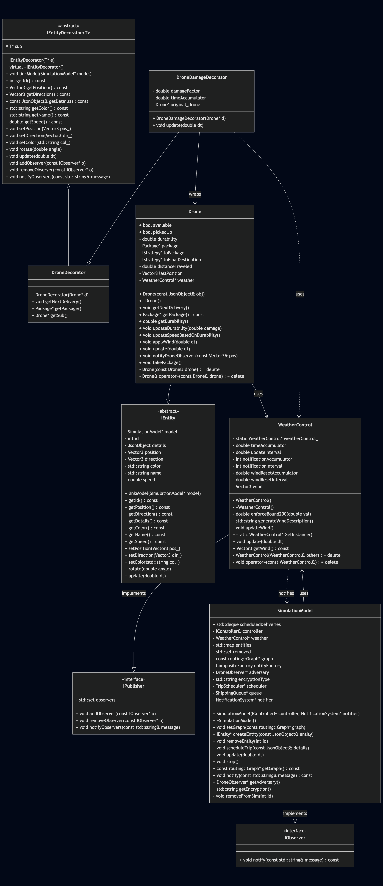

# Team 001-51 Members

    Zachariah Hassan (hassa844) - Data Collection Manager
    Arnav Nayak (nayak086) - Shipping Priority
    Kyle Rumpza (rumpz020) - Ciphered Mail and Interception
    Michael VerBout (verbo032) - Severe Weather

# Overview

This project aimed to extend the "GOPHER Delivery Simulation System". The base code 
provided a simulation of various entities moving around and interacting within the University 
of Minnesota Twin Cities Campus. It supported adding additional human or drone entities
to the simulation during runtime, and also supported the scheduling of deliveries of packages 
by drones to robots. A simple front-end UI acts as a façade to mask the more complicated 
backend operations, and facilitate the user experience. 

The individual extensions to this system which we developed were built upon well-known and 
tested design patterns. To extend the functionality of this system, we built a "Data Collection
Manager" class which acts to collect a variety of relevant statistics throughout each 
unique instance of the application being run, and then export the collected data into a .csv 
file for convenient analysis. To extend the simple queue for package delivery, we implemented 
the priority queue data structure for managing package deliveries. This allowed us to prioritize
deliveries using widely recognized classifications such as: "No Rush", "Standard", and "Expedited".

Next, we focused on adding a level of excitement and intrigue to the program. We began by 
implementing a simulation of cryptographic ciphers to protect the internals of each package. 
To amplify the stakes, a unique "Sky Reaper" drone was developed to fly around attempting to 
intercept and crack the encrypted packages. Finally, to elevate the level of realism, a dynamic 
weather system was developed to simulate random wind patterns of varying severity. Further, 
because small drones are especially susceptible to wind, wind damage was introduced to the 
drones slowing their movement speed until they eventually break down. These enhancements acted 
not only to increase complexity and improve the realism of the simulation but also showcased a 
thoughtful integration of data handling, system design, and user experience considerations.

# Instructions

## Running the Simulation

To run the simulation, you will need to have Docker installed on your machine. Once you have Docker installed, run the following commands in your terminal:

```bash
docker build -t michaelverbout/drone_sim .
```
```bash
docker run --rm -it -p 8081:8081 michaelverbout/drone_sim
```

This will start the simulation server on port 8081 of your local machine. You can access the simulation by opening your browser and navigating to `http://localhost:8081`.

to stop the simulation, click the "Stop Simulation" button in the top right corner of the screen.

## Using the Frontend
A simple panel menu is provided to allow the user to interact with the simulation. This menu is located on the top right
corner of the screen and has the following options:


* Change View: Focus the camera on a specific entity in the simulation.
* Simulation Speed: Adjust the speed of the simulation.
* Show All Routes: Display all available routes for entities in the simulation.
* Schedule Trip: Schedule a new trip for a drone, further details are provided below.
* Add Human: Add a human entity to the simulation.
* Add Drone: Add a drone entity to the simulation, further details are provided below.
* Stop Simulation: Stops the simulation server.
* Export Data: Export the collected data to a csv file, further details are provided below.

## Scheduling A Package
Clicking the "Schedule Trip" button will change the menu to allow the user to schedule a new delivery.


From this panel, the user can provide the following information:
* Name: The name of the package.
* Search Strategy: Search strategy the drone will use to pick up/drop off the package.
* Encryption Strategy: whether the package is encrypted or not. Each encryption algorithm has a different chance of being cracked by the Sky Reaper.
* Priority: The priority of the package. Can be "No Rush", "Standard", or "Expedited". with "Expedited" being the highest priority.

Once this information is provided, the drone will then pick the package from the yellow start location and deliver it to the green drop off location. 
If you no longer want to schedule a delivery, you can click the "Cancel" button.

## Adding A Drone
Clicking the "Add Drone" button will spawn a new drone in the simulation. Each new drone will be named
"Drone-X" where X is the drone's ID. Drones have a default durability of 100. As the simulation runs, the drone's durability will decrease and once it reaches 0, the drone will be removed from the simulation.

## Exporting Data
Clicking the "Export Data" button will export the collected data to a csv file. This file will be named
"simulation_data.csv" and if the file already exists, it will be overwritten. The file will be located
in the root directory and will contain the following information:
* Basic entity information: ID, name, type, and creation time.
* Metrics: Total distance traveled, number of packages delivered, and number of packages lost.
* Drone condition: Condition of each drone. This is based on the drone's durability.

Data cannot be exported if the simulation is stopped. Make sure to export data before stopping the simulation or the collected data will be lost.

# Requirements

### Data Collection Manager:

* The Data Collection Manager shall track the number of packages each drone delivered.

* The Data collection manager shall track the type, name, id, and creation time of each entity and the total distance traveled by each entity throughout the simulation. 

* The Data Collection Manager shall track the number of packages lost to an adversary drone and the condition of each drone.

* If an adversary drone successfully decrypts an encrypted package, The Data Collection Manager shall update the number of packages lost.

* When the user presses the "Export Data" button, the Data Collection Manager shall save the data to a csv file and notify the user if the data was saved successfully.

### Shipping Priority:

* The Shipping System shall let users pick a priority level (No Rush, Standard, or Expedited) for each package.

* The Shipping System shall keep a shipping list that shows all scheduled packages.

* The Shipping System shall show the shipping queue on the control panel with each package’s priority and delivery status.

* When a user schedules a new package, the Shipping System shall set its priority to Standard if no priority has been selected by the user.

* When a user changes a package’s priority, the Shipping System shall move the package to the right spot in the queue based on its new priority.

* When a package is picked up by a drone, the Shipping System shall lock the package’s priority so it can’t be changed.

* If a user tries to change a package’s priority after it’s picked up, then the Shipping System shall show an error message and keep the priority the same.

* If a user tries to schedule a package without picking a priority, then the Shipping System shall show an error message telling the user that the priority type is not selected and would automatically be set to Standard if the user clicks the Continue button.

* While a package is not picked up yet, the Shipping System shall allow users to change its priority.

* While a package is picked up but not delivered, the Shipping System shall show it in the queue with an “On the way” status.

* Where a detailed queue view is included, the Shipping System shall show extra details like package names and destinations in the queue on the control panel.

* While a package is in the queue and not picked up, if a user tries to set an invalid priority (anything not No Rush, Standard, or Expedited), then the Shipping System shall keep the old priority and show an error message.

* While notifications are included, When a new package is scheduled with Expedited priority, if there are already other Expedited packages, then the Shipping System shall place the new package at the end of the Expedited section.

### Ciphered Mail and Interception:

* The \<system\> shall \<ensure only one Sky Reaper drone exists\> 

* The \<system\> shall \<support multiple delivery drones operating at once\> 

* WHEN \<A new user creates an encrypted delivery\> the \<system\> shall \<allow them to select their encryption algorithm\> 

* WHEN \<Drone enters a Sky Reapers radius\> the \<system\> shall \<Have the Sky Reaper lock on to the Drone and moves towards it\> 

* WHEN \<Sky Reaper intercepts a Drone\> the \<system\> shall \<attempt to decrypt the package using brute-force\> 

* WHEN \<a Drone is in the same area as a Sky Reaper Drone\> the \<system\> shall \<ensure the drone doesn’t immediately take the package back\> 

* IF \<Sky Reaper Drone intercepts a Drone carrying a package\> \<brute-force cracking attempt is successful\> THEN the \<system\> shall \<confiscate the drone’s package (mail) and the delivery fails\> 

* IF \<Sky Reaper Drone intercepts a Drone carrying a package\> \<brute-force cracking attempt is unsuccessful\> THEN the \<system\> shall \<have the Sky Reaper drone disengage and the drone continues its delivery\> 

* WHILE \<the simulation is running\> the \<system\> shall \<continue to scan for nearby drones in a fixed radius\> 

* WHILE \<Sky Reaper drone is pursuing a Delivery\> the \<system\> shall \<not pursue another delivery drone\> 

* WHERE \<Encryption is enabled\> the \<system\> shall \<assign a specific probability to be cracked\> 

* WHILE \<Sky Reaper drone is pursuing a drone\> WHEN \<Sky Reaper Drone detects another drone within its fixed radius\> the \<system\> shall \<ensure the Sky Reaper drone continues to pursue the first drone only\> 

### Severe Weather:

* The WeatherControl (Singleton) shall accumulate/track time internally.

* The wind disturbances shall only be applied horizontally.

* When the accumulated delta time reaches or exceeds the update interval attribute, the wind will be updated.

* When each drone updates, the drone will have its position affected by the wind.

* When each drone is affected by the wind, the amount of displacement will be scaled by a factor determined by random noise.

* When the drone’s damage decorator’s time accumulation reaches or exceeds 1 second, the decorator shall apply damage logic to the drone, reducing its durability and speed.

* If the magnitude of the wind exceeds 200, it shall be adjusted accordingly such that its magnitude equals 200 instead.

* While the simulation is running there will only exist one instance of the weather control class.

* While the simulation is running the drones shall be wrapped in a Damage decorator. 

# Design

## Data Collection Manager:
The Data Collection extension provides a centralized data collection and management system for the drone simulation. We used the singleton design pattern with lazy instantiation to ensure that there is only one instance of the data collection manager. This design choice ensures consistent and centralized data tracking across the entire simulation without the need for multiple instances of the data collection manager. We used a map data structure where the key is the entity's ID and the value is a struct containing all metrics for that entity. This design choice provides easy and efficient access to the data for each entity.

### Ciphered Mail and Interception:
This extension extends the functionality of the Package class and the Drone class to implement the Ciphered Mail and Interception extension.
To extend the features of the Package class we used the decorator design pattern to extend encryption to packages. 
The reason for choosing the decorator design class was to extend the Package class while maintaining the base class functionality. 
The design for passing messages between the Drone and SkyReaper that allows the SkyReaper to receive positioning information from Drones once inside a fixed radius uses the Observer pattern. 
The choice for the Observer pattern comes from the ability to send publish/subscribe messages between the two objects. 
We can extend the Drone classes functionality by having it inherit from DronePublisher, and extend the SkyReaper by having it inherit from DroneObserver. 
The Drone can now communicate with the SkyReaper giving its location and a pointer to itself allowing the SkyReaper to target it and perform operations on the drone such as interception. 

### Severe Weather:
To enhance realism and introduce environmental complexity, I developed a Severe Weather extension which simulates ongoing wind disturbances and their damaging effects on drones. A central component of this extension is the WeatherControl class, which I implemented as a Singleton to ensure the wind was applied consistantly to all drones. The choice to use a Singleton also ensured the computational complexity wouldn't spiral out of control, as the wind will only need to be calculated once per second of simulation-time, and can then be accessed by all dependent classes. As such, WeatherControl acts as the global authority for wind data, updating disturbances every second and then providing the current wind status to all drones in the simulation. 

To facilitate communication with the front-end notification window, the Observer pattern was utilized to publish weather update notifications to the SimulationModel. These updates include information about the current magnitude & direction of the wind, along with a periodic notification regarding a wind reset mechanic I implemented. 

Finally, to model the wind-damage drones accrue over time, I implemented the Decorator pattern by creating a DroneDamageDecorator class. This decorator applies wind-based damage without modifying the base Drone class. At fixed intervals, the decorator retrieves the wind intensity from the WeatherControl class and reduces drone durability resulting in slower speed until their eventual destruction. I chose the Decorator pattern for its ability to extend behavior dynamically while leaving the original Drone class largely untouched. This ensured less refactoring of my extension when integrating my code with my other group member's extensions. The utilization of these patterns culminated in a robust extension which is open to future modification, and maintains a low level of coupling to simplify future project extensions and refactors.

# Sprint Retrospective

Our sprint goal was to implement new features for our drone simulation model using design patterns. The sprint lasted approximately one month, and our team consisted of four members. Key deliverables included UML diagrams, a GitHub repository, and a presentation to showcase our work.

### What Went Well
* Branch management made it easy to merge code and create pull requests. Each developer worked in their own local branch, minimizing technical roadblocks.
* Clear separation of responsibilities allowed each team member to focus on their individual component or feature.
* Documentation was thorough, with consistent use of Doxygen and Google-style code documentation standards.
* Google Chat was used effectively for daily communication and quick planning decisions.
* Assigning a dedicated Sprint Captain improved delegation, and streamlined pull request and merge processes.

### What Didn't Go Well
* The Jira sprint board was not followed consistently, becoming more ad hoc as the sprint progressed due to competing project deadlines.
* Some architectural changes introduced technical debt, particularly in areas lacking adequate test coverage.
* There was limited knowledge sharing between team members, and little visibility into individual progress.

### Areas for Improvement
* Hold weekly team meetings or check-ins to ensure better communication and status updates.
* Stick more closely to the sprint plan and regularly update the Jira board.
* Distribute responsibilities more evenly to avoid relying solely on the Sprint Captain for merging and pull requests.
* Consider rotating the Sprint Captain role to balance workload and give everyone experience in leadership tasks.

 
# Jira Board


# UML

### Severe Weather


### Ciphered Mail and Interception:


### Data Manager


# Docker

https://hub.docker.com/repository/docker/michaelverbout/drone_sim/general

# Youtube Presentation
